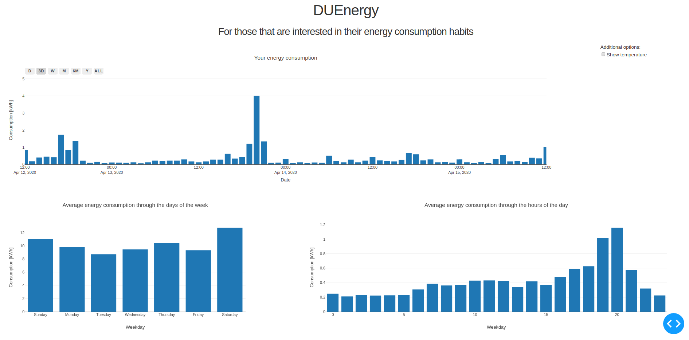

# DUEnergy
Electricity usage data presentation for Tampereen sähkölaitos' customers.

## Initial concept
he motivation for this project was to have easy to use app to view electricity consumption of a household. The web GUI that is offered for the customers do not have possibility to view hourly data, but the data can be downloaded as csv file.  

The project is divided to two pieces data acquisition from customer portal and for the application for the user to view the data. For now, I have only been focused on the app itself.  

## GUI
To have multi-platform software and to make it easily available I decided to make it web based. The main reason was that the web app is accessible with phones also. The app can be run on Raspberry pi which also allows it to keep the data updated. The most of the first version of the UI is done, and it looks something like this: 

The app is almost in usable stage but adding new data can only be done by manually selecting file and editing the source code. The UI will have a few verbal/numerical information about users consuming habits like “You have used 10% more than last week” or something similar. Intention for those verbal comments are to drive user to save energy/money.  

## Last words
The app is written in Python 3 and it is built around Dash/Plotly library. I am familiar with Python but not with HTML or JavaScript. The Dash library allows me to stick with Python without the need to write any JavaScript/HTML.